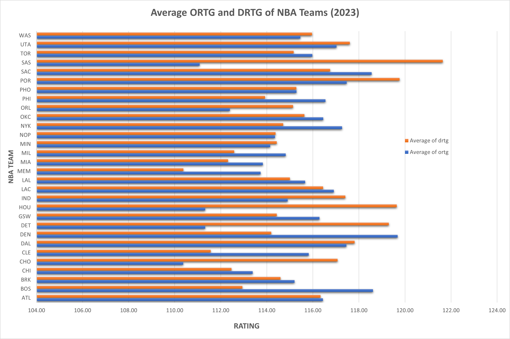
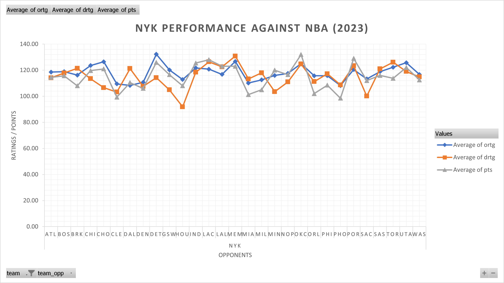

# Spreadsheet Analysis
### By Anas Moazzam

## Source of Data
This dataset was sourced by wesbscraping [basketball-reference.com](https://www.basketball-reference.com/leagues/). This website compiles comprehensive data on every single NBA game since 1946. To webscrape this data, I used BeautifulSoup and Playwright to parse through the HTML tags within the seasons tab, access the games within each season, scrape the box score, and ultimately turned this into a CSV file. At first, I wanted to be ambitious and scrape data from seasons 2014 through 2023. However, since this took over 3 days to complete, I decided to limit the scope of my analysis and focused on the 2022-2023 season for my analysis.

### Raw Data
|    |    mp |    mp |    fg |    fga |   fg% |    team   |
|----|-------|-------|-------|--------|-------|-----------|
|  0 | 240.0 | 240.0 |  38.0 |   72.0 | 0.528 | POR       |
|  1 | 240.0 | 240.0 |  40.0 |   84.0 | 0.476 | MIA       |
|  2 | 240.0 | 240.0 |  41.0 |   78.0 | 0.526 | CLE       |
|  3 | 240.0 | 240.0 |  29.0 |   74.0 | 0.392 | DAL       |
|  4 | 240.0 | 240.0 |  39.0 |   81.0 | 0.481 | ATL       |
|  5 | 240.0 | 240.0 |  36.0 |  100.0 |  0.36 | DAL       |
|  6 | 240.0 | 240.0 |  37.0 |   87.0 | 0.425 | LAL       |
|  7 | 240.0 | 240.0 |  47.0 |  106.0 | 0.443 | TOR       |
|  8 | 240.0 | 240.0 |  37.0 |   85.0 | 0.435 | MIN       |
|  9 | 240.0 | 240.0 |  41.0 |   89.0 | 0.461 | SAS       |
| 10 | 240.0 | 240.0 |  27.0 |   86.0 | 0.314 | ORL       |
| 11 | 240.0 | 240.0 |  34.0 |   99.0 | 0.343 | MEM       |

I only included a lines as there were over 100 columns and over 20,000 games total.

## Webscraping and Cleaning Data
To access the historical data, I decided to webscrape through each season, access each game, then add it into a file. I decided to create a function that gets the html link for each season, and saves it to disk.

```python
async def scrape_season(season):
    url = f"https://www.basketball-reference.com/leagues/NBA_{season}_games.html"
    html = await get_html(url, "#content .filter")
    
    soup = BeautifulSoup(html)
    #get all links with anchor tags from html "a"
    links = soup.find_all("a")
    #getting all links with href within it
    href = [l["href"] for l in links]
    #creating full links for standing pages
    standing_pages = [f"https://basketball-reference.com{l}" for l in href]
    
    #saving to disk so we dont process while scraping
    for url in standing_pages:
        save_path = os.path.join(STANDINGS_DIR, url.split('/')[-1])
        #if we already scraped, don't scrape again
        if os.path.exists(save_path):
            continue
        
        html = await get_html(url, '#all_schedule')
        with open(save_path, 'w+') as f:
            f.write(html)
```
I still needed to access the boxscores of each game so I created another function that gets the html content for each boxscore and adds it to disk. 
```python
async def scrape_game(standings_file):
    with open(standings_file, 'r') as f:
        html = f.read()

    #cleaning links
    soup = BeautifulSoup(html)
    links = soup.find_all('a')
    hrefs = [l.get('href') for l in links]
    boxscores = [l for l in hrefs if l and 'boxscore' in l and '.html' in l]
    boxscores = [f"https://basketball-reference.com{l}" for l in boxscores]

    for url in boxscores:
        save_path = os.path.join(SCORES_DIR, url.split('/')[-1])
        if os.path.exists(save_path):
            continue

        html = await get_html(url, '#content')
        if not html:
            continue
        with open(save_path, 'w+') as f:
            f.write(html)
```
After navigating through all the HTML, I continued to get only the basic box scores of each game, formatting it (such as getting rid of quarterly stats), and adding each boxscore to my dataset. Luckily, this method resulted in pretty clean data, however, also resulted in over 20,000 pieces of data. To consolodate my analysis, I chose to clean my data to only focus on the 2022-2023 season. As there were games from 2014 and over a 100 columns, I used Pandas in python to get my dataset to only games within my desired season and columns.
```python
impt_cols = ['team', 'team_opp', 'fga', 'fg%', '3p', '3p%', 'ft', 
             'fta', 'ft%', 'trb', 'ast', 'stl', 'blk', 'tov', 
             'pf', 'pts', 'ortg', 'drtg', 'season', 'won']

df_2023 = df[df['season'] == 2023]
cleaned_df = df_2023[impt_cols].copy().reset_index(drop=True)
```
### Links to data
- [Raw Data](https://github.com/dbdesign-students-spring2024/3-spreadsheet-analysis-anasmzzm/blob/main/data/nba_games.csv)
- [Cleaned Data](https://github.com/dbdesign-students-spring2024/3-spreadsheet-analysis-anasmzzm/blob/main/data/cleaned_csv)
- [Spreadsheet](https://github.com/dbdesign-students-spring2024/3-spreadsheet-analysis-anasmzzm/blob/main/data/nba_spreadsheet.xlsx) 

## Analysis
I decided to split my analysis into two manners. One was a general outlook on the 2022-2023 NBA season and looking specifcally at my hometown team, the New York Knicks.

### 2022-2023 Overall Analysis
 Here are some fun facts I calculated about the 2022-2023 NBA season, which I used MAX(), MIN(), and AVERAGE() to calculate.

- The maximum points scored in a game this season was 176 scored by the Sacramento Kings. For context, the NBA record is 186!
- The minimum points scored was 79 points which was scored by the Cleveland Cavaliers. The average points scored in the 2023 season was 114 points.
- The average personal fouls per game was about 20 fouls per game.
- The maximum offensive rating scored by a team in a game was 151.3 which was earned by Los Angeles Clippers.

#### Overall NBA Performance


This chart visualizes how NBA teams are rated for their offense and defense.

| Row Labels | Average of pts | Average of fg% | Average ortg | Average 3p% | Average drtg | Average Rebounds |
|------------|----------------|----------------|--------------|--------------|--------------|------------------|
| ATL        | 118            | 48.08%         | 116.43       | 35.26%       | 116.33       | 44.5             |
| BOS        | 116            | 47.55%         | 118.61       | 37.01%       | 112.94       | 45.0             |
| BRK        | 112            | 49.39%         | 115.21       | 38.65%       | 114.60       | 40.0             |
| CHI        | 112            | 49.16%         | 113.39       | 34.41%       | 112.46       | 42.5             |
| CHO        | 112            | 45.65%         | 110.37       | 31.95%       | 117.07       | 44.8             |
| CLE        | 110            | 48.74%         | 115.82       | 35.84%       | 111.56       | 41.2             |
| DAL        | 114            | 47.62%         | 117.45       | 36.71%       | 117.81       | 38.6             |
| DEN        | 117            | 50.83%         | 119.68       | 38.26%       | 114.19       | 43.1             |
| DET        | 111            | 45.65%         | 111.33       | 35.06%       | 119.30       | 42.2             |
| GSW        | 118            | 47.54%         | 116.28       | 38.30%       | 114.43       | 45.2             |
| HOU        | 110            | 45.63%         | 111.32       | 31.86%       | 119.64       | 46.6             |
| IND        | 115            | 46.68%         | 114.91       | 36.62%       | 117.41       | 41.1             |
| LAC        | 115            | 47.54%         | 116.91       | 38.20%       | 116.45       | 43.0             |
| LAL        | 117            | 48.46%         | 115.66       | 34.83%       | 115.01       | 45.7             |
| MEM        | 115            | 46.46%         | 113.73       | 33.67%       | 110.37       | 47.8             |
| MIA        | 110            | 45.88%         | 113.83       | 34.73%       | 112.32       | 41.4             |
| MIL        | 116            | 46.87%         | 114.82       | 36.77%       | 112.58       | 48.5             |
| MIN        | 115            | 49.21%         | 114.15       | 36.38%       | 114.43       | 40.8             |
| NOP        | 114            | 47.78%         | 114.35       | 34.47%       | 114.38       | 43.8             |
| NYK        | 113            | 45.99%         | 117.27       | 34.07%       | 114.71       | 46.4             |
| OKC        | 118            | 46.95%         | 116.45       | 36.76%       | 115.63       | 43.3             |
| ORL        | 111            | 47.07%         | 112.39       | 35.44%       | 115.14       | 42.7             |
| PHI        | 113            | 47.39%         | 116.55       | 37.50%       | 113.93       | 41.3             |
| PHO        | 113            | 46.82%         | 115.29       | 37.47%       | 115.28       | 43.7             |
| POR        | 115            | 48.20%         | 117.47       | 37.23%       | 119.77       | 40.5             |
| SAC        | 120            | 48.85%         | 118.55       | 35.64%       | 116.75       | 42.8             |
| SAS        | 113            | 47.08%         | 111.09       | 33.80%       | 121.64       | 43.5             |
| TOR        | 113            | 45.63%         | 115.98       | 32.89%       | 115.17       | 43.1             |
| UTA        | 117            | 47.48%         | 117.03       | 35.38%       | 117.61       | 45.4             |
| WAS        | 114            | 48.65%         | 115.45       | 35.31%       | 115.97       | 44.0             |

This pivot table highlights some key indicators of performance for each NBA team. It calculated the Average points, FG%, ORTG, 3P%, DRTG, and Rebounds per game for each team.

### 2022-2023 New York Knicks
Here are some statistics on the Knicks and their 2023 season which were calculated using AVERAGEIF(), AVERAGEIFS(), and MAXIFS():  
- The Knicks scored an average of 112 points per game which was below the league wide average. However, they were known for their defense during this season.
- The Knicks scored a season high 140 points against the Detroit Pistons.
- During wins, they averaged a ORTG of 119.89 and a 3p% of 35.54%.



This chart visualizes key metrics of the NYK against other NBA teams.

| Row Labels | Average of ortg | Average of drtg | Average of pts |
|------------|------------------|------------------|----------------|
| NYK        |                  |                  |                |
| ATL        | 118.58           | 114.10           | 115            |
| BOS        | 118.90           | 117.83           | 116            |
| BRK        | 116.23           | 121.43           | 108            |
| CHI        | 123.57           | 113.43           | 120            |
| CHO        | 126.50           | 106.60           | 121            |
| CLE        | 109.49           | 103.20           | 99             |
| DAL        | 108.30           | 121.20           | 111            |
| DEN        | 110.70           | 107.60           | 106            |
| DET        | 132.23           | 114.27           | 126            |
| GSW        | 120.15           | 104.90           | 117            |
| HOU        | 112.80           | 91.90            | 108            |
| IND        | 121.73           | 118.40           | 126            |
| LAC        | 120.80           | 126.40           | 128            |
| LAL        | 116.80           | 122.50           | 123            |
| MEM        | 126.70           | 130.80           | 123            |
| MIA        | 110.16           | 113.29           | 101            |
| MIL        | 112.60           | 117.95           | 105            |
| MIN        | 116.00           | 103.50           | 120            |
| NOP        | 117.50           | 110.95           | 117            |
| OKC        | 125.00           | 124.70           | 132            |
| ORL        | 115.70           | 111.20           | 102            |
| PHI        | 115.80           | 117.20           | 109            |
| PHO        | 108.20           | 108.65           | 99             |
| POR        | 120.50           | 123.30           | 129            |
| SAC        | 113.30           | 100.10           | 112            |
| SAS        | 118.85           | 120.95           | 116            |
| TOR        | 122.28           | 126.10           | 114            |
| UTA        | 125.75           | 119.00           | 122            |
| WAS        | 116.70           | 114.78           | 113            |

This pivot table highlights key statistics of the Knicks against other teams around the NBA.

## Extra Credit

Although I did not follow the exact steps for extra credit, I believe it was necessitated by what I wanted to accomplish initially and still shows that I attempted to practice webscraping and working with large amounts of data. I webscraped over 20000 pieces of NBA game data but due to resource limitations, my 'cleaned' data had a little over 1900 pieces of data. Either way, this was a fun project I completed and I appreciate the consideration.